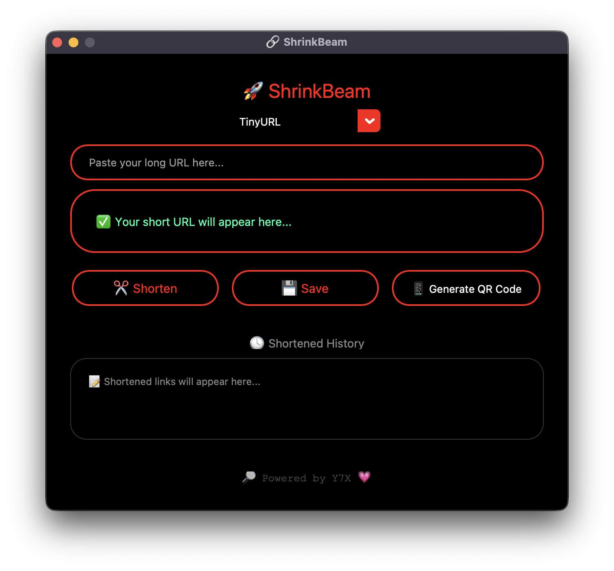

# 🚀 ShrinkBeam

A sleek, glowing **Link Shortener + QR Code Generator** built with `customtkinter`.  
Designed for **AMOLED screens**, red-hot accents, and a premium feel.



---

## 🔥 Features

- ✂️ Shorten long URLs instantly (TinyURL, is.gd)
- 📋 Auto-copy to clipboard
- 📱 One-click QR Code generation
- 💾 Save links to text files
- 🕓 View history with timestamps
- 🌑 Full AMOLED mode with hot red outlines
- 💗 Glowing UI with modern, symmetric layout

---

## 🛠️ Tech Stack

- `Python 3.10+`
- `customtkinter` – modern UI
- `pyshorteners` – URL shortening
- `pyperclip` – clipboard support
- `qrcode` – QR generation

---

## 🚀 How to Run

```bash
pip install -r requirements.txt
python ShrinkBeam.py